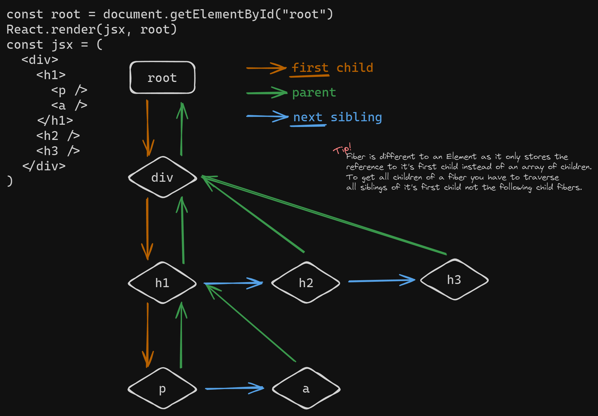

# Crude React

This project is a crude recreation of React library purely for hobbyst/educational purposes.

The scope of this project encapsulates the client side part of React in its pre RSC era.

For the best understanding of the operation I would suggest starting with :

- JSX transpilation
- render phase
- commit phase

> If you want to peek at the results of JSX transpilation take a look at `out/index.js` or use the [Bun.Transpiler](https://bun.sh/docs/api/transpiler)

<details>
<summary>TLDR on React Fiber and Element</summary>

You will encounter two main interfaces while looking through this codebase.
One of the will be a `React.Element` and another one will be `React.Fiber`.

You can think of `React.Element` as an object representation of the JSX that gets passed down to the `render` function.

`React.Fiber` is a representation of the work that needs to be done to render the elements. It takes a form of a tree, which is composed of singly-linked list of child nodes linked to each other (sibling relationship) and a doubly-linked list of parent-child relationships.



</details>

## Getting started

To install dependencies:

```bash
bun install
```

To run:

```bash
bun run build # builds the crude react library into out/
bun run serve # runs a simple http server with a playground
```

> This project was created using `bun init` in bun v1.1.10. [Bun](https://bun.sh) is a fast all-in-one JavaScript runtime.

---

Big shout out to some great resources:

- https://pomb.us/build-your-own-react/
- https://github.com/acdlite/react-fiber-architecture
- https://medium.com/@aliWhosane/react-fiber-data-structure-demystified-d3794470a8a4
- https://www.dhiwise.com/post/building-high-performance-applications-with-react-fiber#understanding-the-fiber-architecture
- https://angularindepth.com/posts/1007
- https://github.com/facebook/react/issues/7942?source=post_page---------------------------#issue-182373497
- https://blog.logrocket.com/deep-dive-react-fiber/#what-react-fiber
